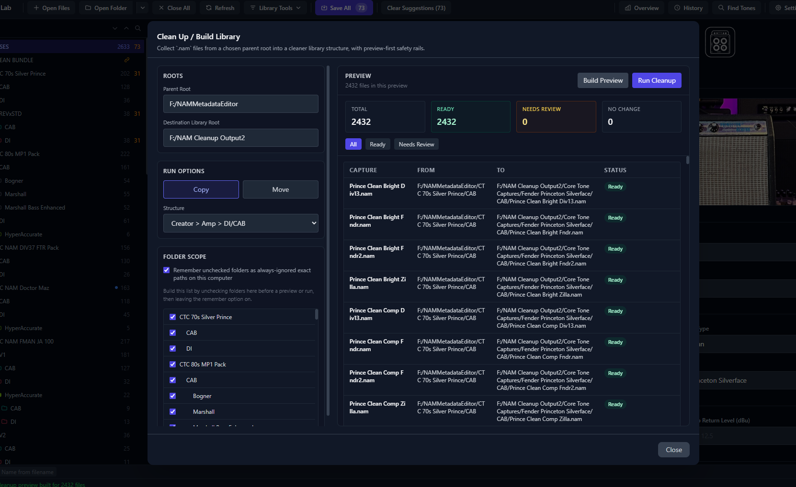
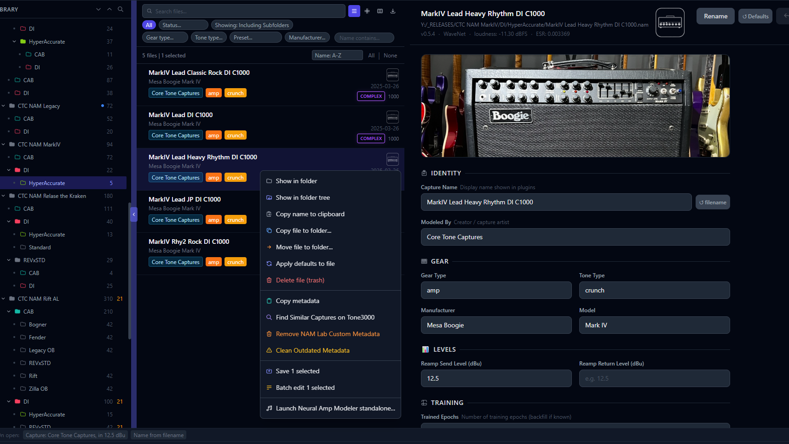
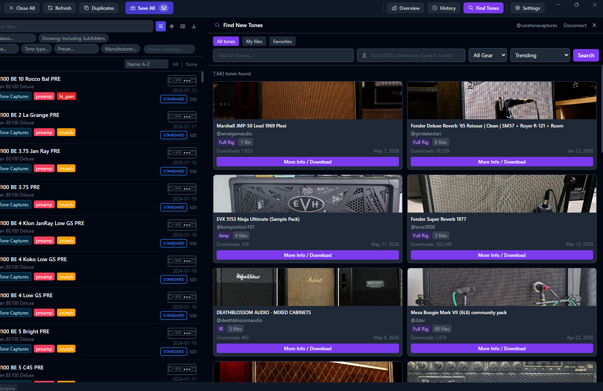

# NAM Lab Workflows

This guide focuses on practical workflows rather than feature lists. Use it when you know what kind of cleanup you want to do but are not sure which tool path fits best.

For the full feature inventory, see [features.md](features.md).

---

## 1. Build a cleaner library from a messy parent root

Use this when you have:
- downloads scattered across many folders
- a staging area
- a broad intake folder
- multiple creator folders that are not consistently organized

Open:
- **Library Tools -> Clean Up / Build Library...**

Recommended first pass:
1. Pick a broad parent root that contains the captures you want to collect.
2. Pick a destination library root.
3. Leave the action on `Copy` for the first serious run.
4. Choose a structure:
   - `Creator`
   - `Creator > Amp`
   - `Creator > Amp > DI/CAB`
   - `Creator > Amp > DI/CAB > Preset Type`
5. Build the preview.
6. Check:
   - `Ready`
   - `Needs Review`
   - `No Change`
7. Export the `Needs Review` list if you want to fix that subset later.
8. When the preview looks right, run the cleanup.

Recommended mindset:
- use top-level cleanup when the source is broad or mixed
- use `Copy` first when testing structure
- treat `Needs Review` as a staging bucket, not as failure

---

## 2. Clean one folder or subtree in place

Use this when you already trust the folder you are looking at and want to organize it more deeply.

Examples:
- a creator folder
- a specific amp folder
- a flat DI folder
- a repaired `Needs Review` bucket

Open:
- right-click folder -> **Clean this folder...**

How it behaves:
- the selected folder becomes an **anchor**
- matching creator / amp path segments already represented by that folder are not rebuilt inside it again

That means if you are already inside:
- `2dor/Mesa Boogie Mark VII`

and you clean that folder with a deeper structure, NAM Lab should build:
- `DI/...`
- `CAB/...`
- preset-type folders

instead of creating another nested:
- `2dor/Mesa Boogie Mark VII/...`

Use this when the folder is mostly homogeneous and you want to deepen the organization, not rebuild the whole library.

---

## 3. Repair files in `Needs Review` and recategorize them

This is one of the most important workflows in the app.

Typical flow:
1. Run a broad cleanup.
2. Let uncertain files land in `Needs Review`.
3. Batch-edit or individually fix the missing metadata.
4. Right-click `Needs Review`.
5. Choose **Clean this folder...**
6. Let the destination point to the **parent library root**.
7. Run cleanup again.

Expected result:
- repaired files move back out of `Needs Review`
- they land as deeply as the now-correct metadata allows

This is often the fastest way to process large messy imports:
- one broad pass
- one metadata repair pass
- one focused recategorize pass

---

## 4. Repair placeholder metadata like `tz-make` / `tz-model`

This is common with imported Tone3000 captures and other incomplete uploads.

Typical problem:
- files land under a junk subtree such as:
  - `amalgamaudio/tz-make tz-model/di`

You then fix the metadata so they really belong under:
- `amalgamaudio/gibson g200/di`

The key choice is the destination root:
- set **Destination Library Root** to `amalgamaudio`
- not to `tz-make tz-model`
- not to the current `di` folder

Why:
- the currently selected folder acts like an anchor
- leaving the destination on the junk subtree tells NAM Lab to keep building under that branch

So the rule of thumb is:
- if the current subtree name is wrong, point cleanup to the **parent branch you want to keep**

---

## 5. Use metadata suggestions for structured filename styles

Use this when the files themselves are named consistently even if the metadata is not.

Good fit:
- one creator's naming style
- one pack with repeated segment structure
- a batch you downloaded that uses the same conventions

Open:
- right-click folder -> **Edit folder suggestion rules...**
- or use global rules for patterns that are library-wide

Tools to know:
- **Suggest metadata...**
- **Build from example...**
- rule library
- overwrite guards
- Pack Info glossary / switches -> rule generation

Example naming style:
- `JCM800 Lo P6 B8 M4 T7 G10`

Possible meaning:
- `JCM800` -> make/model
- `Lo` -> amp switch
- `P6 B8 M4 T7 G10` -> amp settings

This works best when the naming style is consistent across a set of files.

Helpful reminder:
- in `Prefix + value`, `{value}` means "the part after the prefix"
- `{match}` means "the full token"
- example:
  - token `G`
  - template `Gain {value}`
  - `G10` becomes `Gain 10`

---

## 6. Choose between global rules and folder rules

Use **global rules** when:
- the token meaning is stable everywhere
- example: `Mesa` almost always means a Mesa cabinet in your whole library

Use **folder rules** when:
- the meaning changes by creator or batch
- example: inside one creator subtree, `Mesa` means the amp make, not the cabinet

Folder rules override global token meaning in that subtree.

That makes folder-scoped repair much safer than relying only on one giant global ruleset.

---

## 6b. Turn Pack Info into folder rules

If you already have useful pack notes, glossary entries, or switch definitions in Pack Info, you can use those as a cleaner source for folder-scoped metadata rules.

Good fit:
- token legends such as `HG = High Gain`
- switch lines such as `CH2 = Crunch`
- channel / mode notes that belong only to one pack or creator subtree

Practical flow:
1. Open the folder's **Pack Info**.
2. Curate the **Glossary** or **Switches & Modes** entries first.
3. Choose a target field such as:
   - `Amp Channel`
   - `Amp Switches`
   - `Tone Type`
   - `Boost Pedal(s)`
   - `Comments`
4. Click:
   - `Create selected rules`
   - or `Create all rules`
5. NAM Lab opens the folder rule editor immediately so you can review before applying suggestions.

This is often a better workflow than reparsing raw description text every time, because the Pack Info sections are already partially structured.

---

## 7. Use overwrite rules carefully

Normal suggestion rules only fill blank fields.

Use **Overwrite** when:
- you know the field contains junk placeholder values
- you want the rule to repair that field even though it is not empty

Best practice:
- guard overwrite rules to only hit known junk values like:
  - `tz-make`
  - `tz-model`
  - `Unknown`
  - `N/A`

That gives you repair power without turning every overwrite into a broad hammer.

---

## 8. Copy metadata from another folder without overwriting good data

Use this when you have two similar folders and one already has better metadata.

Good fit:
- alternate architectures of the same pack
- DI and CAB variants with matching capture names
- rebuilding blanks in a fresh folder from an older curated folder

Open:
- right-click the destination folder in the tree
- choose **Copy metadata from folder...**
- browse to the source folder

How matching works:
- NAM Lab tries embedded metadata name first
- if that is blank, it falls back to filename
- matching is case-insensitive

Safety behavior:
- only blank destination fields are filled
- existing destination values are preserved
- after confirmation, the copied metadata is written to disk

Practical mindset:
- use this as a fill-blanks helper, not as a full sync tool
- if the destination already has curated values, they should stay intact

---

## 9. Use duplicate modes intentionally when names are unreliable

If filenames and metadata names are inconsistent, pick the duplicate mode that matches the question you are actually asking.

Use **Content** when you want:
- hashes the full `.nam` file
- finds true byte-for-byte duplicates

Use:
- `Filename` mode when you want same-name cleanup
- `Meta Name` when you care about the embedded capture name
- `Content` when you want exact duplicate files regardless of names
- `Same Model, Metadata Differs` when you want to find captures whose underlying model matches but one copy has cleaner or repaired metadata

That last mode is especially useful during metadata cleanup when you suspect you have:
- one file with placeholder metadata such as `tz-make` / `tz-model`
- and another copy of the same capture whose metadata has already been corrected

---

## 10. Suggested first-time cleanup strategy

If you are starting from a very messy library:

1. Run top-level cleanup in `Copy` mode.
2. Review `Needs Review`.
3. Batch-fix obvious creator / make / model issues.
4. Use folder-scoped rules for creator-specific meaning.
5. Re-run cleanup on `Needs Review`.
6. Use duplicate detection after structure is mostly sane.
7. Only switch to `Move` when you trust the pattern.

This tends to be the least stressful path and gives you easy checkpoints if something unexpected shows up.

---

## 11. Browse your library in card view

Use card view when you want a visual gallery overview instead of a folder tree.

Open it:
- click the **Cards** (grid) icon in the toolbar (disabled when no folder is loaded)
- click again to return to the three-panel view

Typical use cases:
- visually confirm all your packs have amp cover images
- quickly navigate into a specific folder without scrolling the tree
- find something by cover art rather than by name

Drill-down navigation:
- **Double-click** a card to go one level deeper (stays in card view)
- Use the **breadcrumb bar** to go back up
- Use **Refresh** in the breadcrumb bar to rescan the current level without leaving card view

Preview panel:
- **Single-click** a card to open the preview panel on the right
- Shows amp cover, folder name, counts, and pack info
- Panel is resizable by dragging the handle; width persists between sessions

Getting cover images:
1. Right-click a folder card
2. Choose **Get Cover Image**
3. Options:
   - paste an image URL
   - drag-drop from a browser or Windows Explorer
   - click **Browse** for a native file picker
   - click the Google Images button to open a browser search

Downloading from Tone3000 inside card view:
1. Right-click a card
2. Choose **Find on Tone3000**
3. Tone3000 opens in the right panel — browse and download without leaving card view
4. When the download completes the new folder card appears automatically

---

## 12. Save auto-filled values intentionally

Some NAM Lab tools preview values before writing them to disk.

Common examples:
- auto-fill-on-load defaults
- metadata suggestions
- other in-session blank-field helpers

Practical rule:
- use **Clear suggestions** if you want to discard previewed values
- use **Apply** in multi-select when you want those visible values committed for the selected files
- use **Save All** when you want all current dirty files written

If you can see a suggested or auto-filled value and want to keep it, do not assume it is already on disk until you Apply, Save, or Save All.

---

## 13. Tone3000-assisted intake workflow

If you are actively collecting new captures from Tone3000, a practical flow is:

1. Browse and download captures inside NAM Lab.
2. Let them land in a staging or intake area.
3. Run top-level cleanup in `Copy` mode first.
4. Fix any `Needs Review` items.
5. Re-run cleanup on the repaired subset.

This tends to keep downloading, tagging, and final library organization in one place instead of bouncing between several tools.
